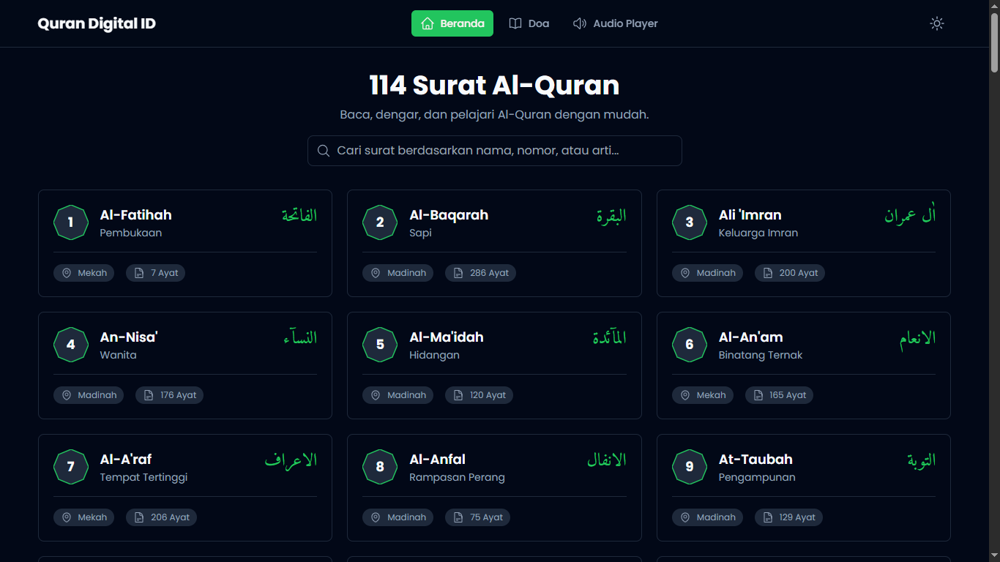

# Qur'an Digital ID V1



Qur'an Digital ID adalah platform Al-Qur'an digital modern yang menyediakan akses mudah untuk membaca ayat suci, mendengarkan lantunan murottal merdu, memahami makna melalui tafsir, serta dilengkapi dengan kumpulan doa harian untuk menyempurnakan ibadah Anda.

---

## ✨ Fitur Utama

-   📖 **114 Surat Al-Qur'an**: Tampilan lengkap dengan terjemahan, transliterasi, dan tafsir per ayat.
-   🤲 **Kumpulan Doa Harian**: Ratusan doa harian yang dikelompokkan berdasarkan kategori.
-   🎧 **Audio Player**: Dengarkan murottal lengkap per surat dari 5 qari internasional.
-   🔊 **Audio per Ayat**: Putar lantunan ayat tertentu langsung dari halaman baca.
-   🔍 **Pencarian & Filter**: Cari surat atau doa dengan mudah, dan filter doa berdasarkan kategori.
-   🌓 **Tema Gelap & Terang**: Ganti mode tampilan untuk kenyamanan membaca di segala kondisi cahaya.
-   📱 **Desain Responsif**: Tampilan yang optimal di perangkat desktop maupun mobile.
-   ⬆️ **Tombol Kembali ke Atas**: Navigasi yang mudah di halaman yang panjang.

---

## 🚀 Teknologi yang Digunakan

-   **React**: Library JavaScript untuk membangun antarmuka pengguna.
-   **Vite**: Alat build modern yang sangat cepat untuk pengembangan web.
-   **Tailwind CSS**: Framework CSS untuk desain yang cepat dan responsif.
-   **React Router**: Untuk routing dan navigasi antar halaman.
-   **Axios**: Untuk melakukan permintaan data ke API.
-   **Heroicons**: Koleksi ikon SVG yang indah.

---

## 📊 Sumber Data

Aplikasi ini sepenuhnya menggunakan data dari API publik yang disediakan oleh **[equran.id](https://equran.id)**.

---

## 🛠️ Cara Menjalankan Proyek Secara Lokal

1.  **Clone repositori ini:**
    ```bash
    git clone https://github.com/ofikur/alquran-digital-id.git
    ```

2.  **Masuk ke direktori proyek:**
    ```bash
    cd quran-digital-id
    ```

3.  **Install dependensi:**
    ```bash
    npm install
    ```

4.  **Jalankan server development:**
    ```bash
    npm run dev
    ```
    Aplikasi akan berjalan di `http://localhost:5173`.

---

## 🙏 Ucapan Terima Kasih

Segala puji dan syukur kami panjatkan kehadirat **Allah SWT** atas rahmat, karunia, dan kemudahan yang diberikan sehingga proyek aplikasi Quran Digital ID ini dapat diselesaikan. Semoga aplikasi ini dapat menjadi amal jariyah dan bermanfaat bagi umat.

Kami juga mengucapkan terima kasih yang tulus kepada tim **equran.id** atas penyediaan API publik yang luar biasa, yang menjadi tulang punggung dari seluruh data dalam aplikasi ini.